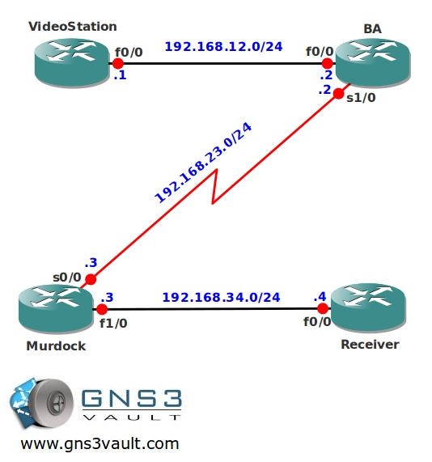

# Multicast Stub & IGMP Helper

## Scenario

Your career started in the 80's as a star in a famous action show, almost 30 years later your career is even more successful as a senior networking engineer. The company you are working for broadcasts old action series by using multicast, one of the branch offices however has performance problems with an old router. You need to make some changes to fix this, because you love it when a plan comes together...

## Goal

- All IP addresses have been preconfigured for you.
- Configure OSPF on all routers, advertise all networks. Achieve full connectivity.
- Configure router Receiver to join the multicast group 224.4.4.4 on it's Fastethernet interface.
- Configure dense-mode multicast between router VideoStation and BA.
- Configure dense-mode multicast between router BA and Murdock.
- Make sure router Receiver can receive the multicast stream, test this by sending a ping to 224.4.4.4 from router VideoStation.
- You are not allowed to form a PIM neighbor relationship between router BA and murdock.

## IOS

c3640-jk9s-mz.124-16.bin

## Topology

## Video Solution

http://www.youtube.com/watch?v=rLG45ALJya8
