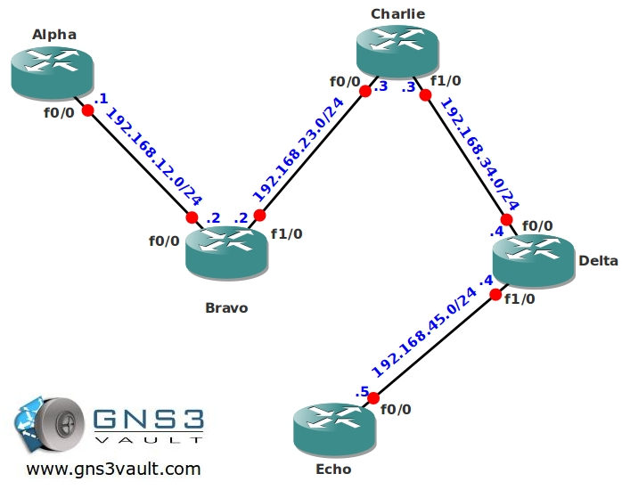

# Multicast Tunneling

## Scenario

It's your first day in the army working as a networking professional. You are sent to a small international outpost to look after the network. It's a rather old network but they need you to install Multicast so they can stream audio in a efficient matter over the network. There is one problem though...there's one router that is so old that it doesn't support Multicast, let's check it out.

## Goal

- All IP addresses have been preconfigured for you.
- Configure OSPF on all routers, achieve full connectivity.
- You are allowed to configure dense-mode Multicast on all routers EXCEPT router Charlie.
- Configure router Echo to join the following multicast group: 224.1.1.1
- Start a ping from router Alpha to the multicast group address 224.1.1.1 to generate traffic.
- Make sure router Echo can receive the multicast stream without configuring multicast on router Charlie.

## IOS

c3640-jk9s-mz.124-16.bin

## Topology

## Video Solution

http://www.youtube.com/watch?v=Jm6sJLVj8NY
