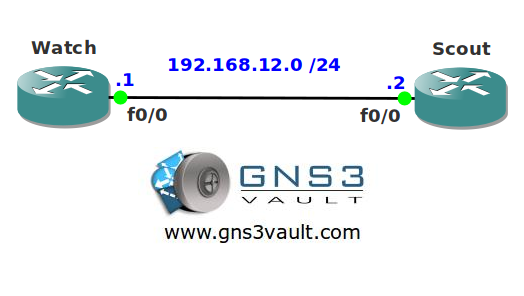

# Access-List Logging

## Scenario

The local boyscout needs your help as a network engineer. They want to make sure everytime their router receives an OSPF packet this will be logged on their local router. Think you can help them out?

## Goal

* All IP addresses have been preconfigured for you.
* OSPF has been configured for you.
* Configure router Scout so every OSPF packet that is received on the interface will be logged. Use an access-list for this.
* Your log file should be updated every 4 packets.
* Make sure you log the MAC address of the device sending the OSPF packet.

## IOS

c3640-jk9o3s-mz.124-16.bin

## Topology

## Video Solution

http://www.youtube.com/watch?v=qlU9U3kZXgI
