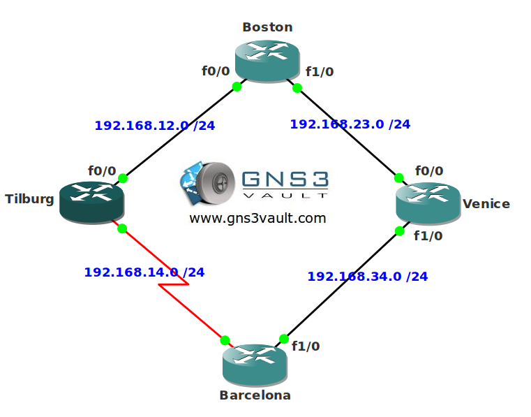

# Backup Interface

## Scenario

You are responsible for a number of routers of a network that connects multiple cities. Whenever router Barcelona sends traffic towards Boston it has to use the link to Tilburg. Unfortunately it is load balancing since the paths are equal. You don't want to make any changes to the routing protocol because you don't want to impact the whole network. You decide to configure a backup interface on router Barcelona.

## Goal

- All IPv4 addresses have been preconfigured for you.
- EIGRP has been configured for connectivity.
- Configure router Barcelona so F1/0 is a backup interface. Whenever F0/0 goes down it should enable F1/0.

## IOS

c3640-jk9s-mz.124-16.bin

## Topology

## Video Solution

http://www.youtube.com/watch?v=2iIWtINTEiE
