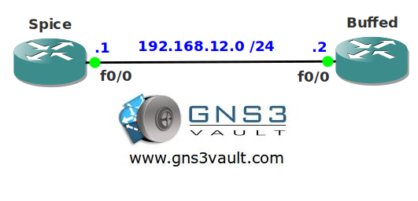

# Buffer Tuning

## Scenario

After a hard day of studying networking you decide to chill out and head for the local gym. As soon as you arrive the owner of the place comes to you and he seems to be upset. A staff member tried to buff up the routers but something went terrible wrong. Your brain is sore but do you think you can push one more rep?

## Goal

- All IP addresses have been preconfigured for you.
- Configure router Buffed for automatic buffer tuning.
- Configure router Spice to triple all public buffers.
- Configure router Spice so there are at least 20 Large and Huge buffers available.

## IOS

c3640-jk9o3s-mz.124-16.bin

## Topology

## Video Solution

[http://www.youtube.com/watch?v=5zkrX_FrWLE](http://www.youtube.com/watch?v=5zkrX_FrWLE)
