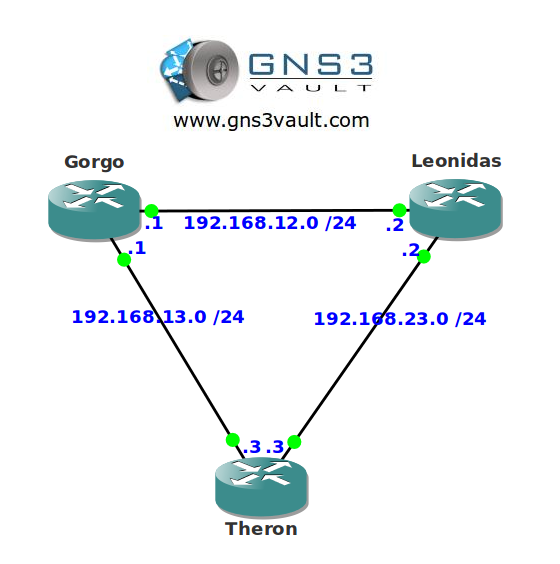

# CDP (Cisco Discovery Protocol)

## Scenario

Since the average life expectancy of a spartian warrior isn't very promising, some of them decided to switch careers and become network engineer. The spartian engineers really enjoy CDP (Cisco Discovery Protocol) but they would like to tune some settings to their liking.

## Goal

- All IP addresses have been preconfigured for you (but you won't really need them).
- Make sure there are no CDP packets sent between router Gorgo and Theron.
- Create a loopback0 interface on router Gorgo with IP address 1.1.1.1 /24.
- Configure router Gorgo so the IP address of the loopback0 interface will show up in CDP advertisements.
- Configure all routers to send CDP packets every 5 seconds.
- Configure router Leonidas so it tells its neighbors to keep CDP packets for 20 seconds.
- Configure all routers so CDP doesn't log any duplex mismatch errors.

## IOS

c3640-jk9s-mz.124-16.bin

## Topology

## Video Solution

[CDP Video Solution on YouTube](http://www.youtube.com/watch?v=Zy7UEREcolQ)
