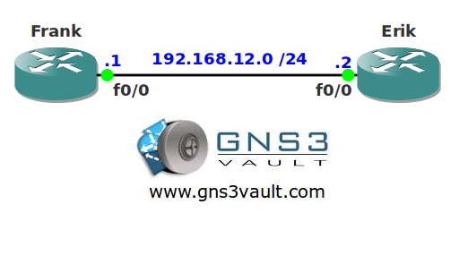

# Conditional Debug

## Scenario

Frank has heard about a feature called "conditional debug" that sounds interesting to him. It seems that you can use this command to only show the output of certain protocols instead of having your screen flooded with debug information. Think you can teach a fellow network engineer this feature?

## Goal

* All IP addresses have been preconfigured for you.
* OSPF and RIP have been preconfigured to generate some traffic.
* Enable a debug on router Frank which only shows RIP information on the FastEthernet0/0 interface. You are not allowed to use any access-lists.

## IOS

c3640-jk9o3s-mz.124-16.bin

## Topology

## Video Solution

http://www.youtube.com/watch?v=L6iQy1mAE4s
