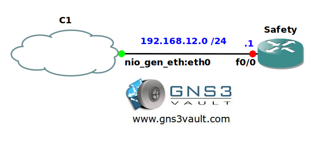

# Configuration Archive to TFTP

## Scenario

Recently your company was audited and didn't pass the security test. One of the complaints was that there is no automated backup mechanism for routers. You decide to configure your network so the routers will copy their configuration every 24 hours to a TFTP server.

## Goal

* All IP addresses have been preconfigured for you.
* Configure router Safety so it will save its configuration every 24 hours to TFTP server 192.168.12.2.
* Everytime you save your running-config to the startup-config it should also be copied to the TFTP server.

## IOS

c3640-jk9o3s-mz.124-16.bin

## Topology

