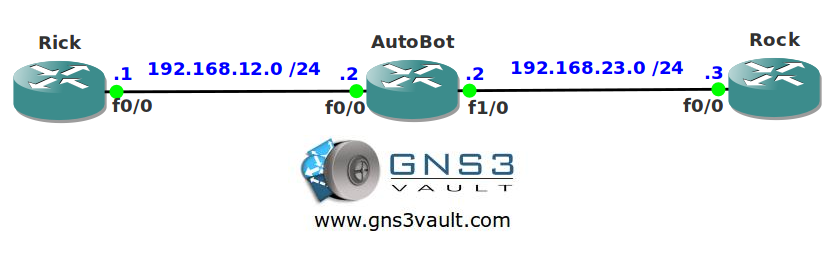

# EEM Scripting

## Scenario:

Ever since you switched your career from Linux engineer to networking you missed your good old scripting tools. You just heard about network engineer about EEM scripting for Cisco routers and you can't wait to try it out!

## Goal:

* All IP addresses have been preconfigured for you.
* Configure router Autobot so when the FastEthernet 0/0 interface goes down a script runs that also shuts down the FastEthernet1/0 interface.
* You are only allowed to use EEM scripting to achieve this.

## IOS:

c3640-jk9s-mz.124-16.bin

## Topology:

**You need to register to download the GNS3 Topology File. (Registration is Free!)**
