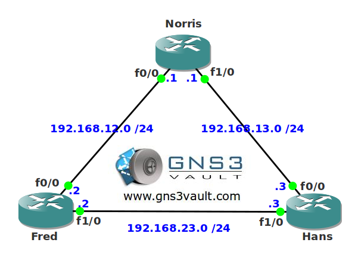

# Exec Alias

## Scenario

You run a local petshop located in The Netherlands and the network in use has been configured for you. Your colleagues like routers but they are not used to working with the command-line. You decide to help them by using exec aliases for some of the commands they require most.

## Goal

* All IP addresses have been preconfigured for you.
* OSPF has been configured for connectivity.
* Typing "shr" should show the routing table.
* Typing "sho" should show the OSPF database.
* Typing "i l0" in global configuration mode should switch to the configuration of the loopback0 interface.
* Typing "newsa VAULT" in global configuration mode should create a new standard access-list called VAULT.

## IOS

c3640-jk9s-mz.124-16.bin

## Topology

