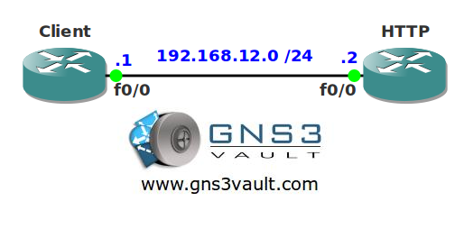

# IOS HTTP Server

## Scenario

You are working as a network engineer for a Charity helping homeless people. At one day the webserver crashes and you don't have any spare equipment lying around. Since the website only has HTML images you decide to configure one of your spare routers as a HTTP server.

## Goal

* All IP addresses have been preconfigured for you.
* Configure router HTTP as a HTTP server and make it serve files from the flash.
* Configure router HTTP so it only allows HTTP connections from port 5001 and the 192.168.12.0/24 network. There should be a maximum of 5 connections.
* Configure router HTTP so users have to authenticate to access the webserver. Use the username "VAULT" and password "SAFE".
* Test your configuration by transfering a file stored on router HTTP to router CLIENT.

## IOS

c3640-jk9s-mz.124-16.bin

## Topology

## Video Solution

http://www.youtube.com/watch?v=MDprS6DIWHc
