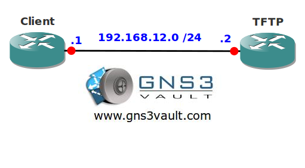

# IOS TFTP Server

## Scenario

You are working as a network engineer for a Charity helping homeless people. At one day the webserver crashes and you don't have any spare equipment lying around. The website is used to download food coupons.

## Goal

- All IP addresses have been preconfigured for you.
- Configure router TFTP as a TFTP server.
- Configure router TFTP so only network 192.168.12.0 /24 is allowed to access the TFTP server.
- When router Client tries to download a file called "config" it should receive the configuration file of router TFTP.
- Test your configuration by copying the "config" file from router Client by using TFTP.

## IOS

c3640-jk9s-mz.124-16.bin

## Topology

## Video Solution

http://www.youtube.com/watch?v=hWWV6Ax5jOo
