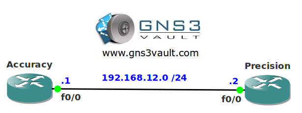

# Logging Timestamps

## Scenario

"Time 'r Us" is a large swiss company selling a wide range of watches. Recently the company was hacked but the company's security officer traced down the hacker. Unfortunately the hacker got away because the log files didn't have any date or timestamps on it and couldn't be used as evidence in court. You as a security specialist decide to change this for the future and implement timestamps for logging on your routers.

## Goal

- All IP addresses have been preconfigured for you.
- EIGRP has been configured for connectivity.
- Configure router Precision so it saves date-time on its timestamps.
- Configure router Accuracy so it saves uptime on its timestamps.
- Configure both routers to save year information in their logging messages.
- Configure Router Accuracy so it adds milliseconds to the timestamps.
- Configure both routers to prevent tampering with stored logging information.

## IOS

c3640-jk9s-mz.124-16.bin

## Topology

