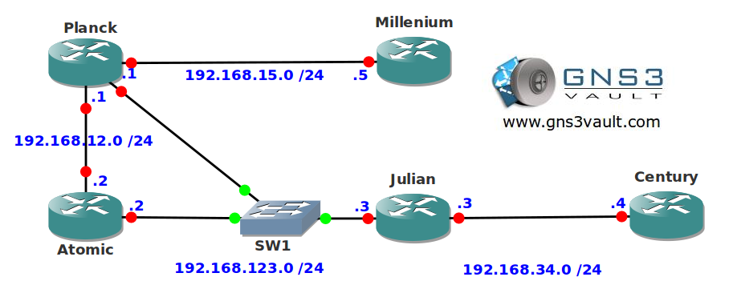

# NTP (Network Time Protocol)

## Scenario

You are the owner of a Swiss watch factory. Time is everything to you and the same applies to your network. You want to make sure that your complete network is synchronized and up-to-date. Now get going since time is money!

## Goal

* All IP addresses have been preconfigured for you.
* EIGRP has been configured for full connectivity.
* Configure router Planck and Atomic to be NTP Masters, use stratum 10.
* Make sure router Planck and Atomic synchronize with each other.
* Router Julian has to check router Planck and Atomic for NTP updates, it has to prefer router Atomic.
* Configure router Julian so it broadcasts NTP packets on its FastEthernet 1/0 interface.
* Configure router Century so it configures itself using the NTP broadcast packets from router Julian.
* Configure router Planck to send NTP packets to multicast address 239.5.5.5.
* Configure router Millenium to configure itself using the NTP multicast packets.

## IOS

c3640-jk9s-mz.124-16.bin

## Topology

## Video Solution

[http://www.youtube.com/watch?v=3rFSwtPnp3g](http://www.youtube.com/watch?v=3rFSwtPnp3g)
