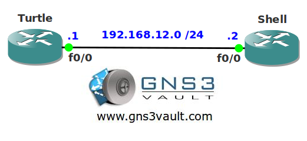

# Remote Shell

## Scenario

You are working as a network engineer at a Turtle Aquarium based in Florida. Your colleague wants to check the running-configuration of one of the routers in the network but because of the security policy he's not allowed to use HTTP, TFTP, TELNET or SSH. You can't break company regulations but maybe you can bend it a little?

## Goal

* All IP addresses have been preconfigured for you.
* Configure router Shell so router Turtle can view its running configuration.

## IOS

c3640-jk9s-mz.124-16.bin

## Topology

## Video Solution

http://www.youtube.com/watch?v=Y3LAM8P3j7s
