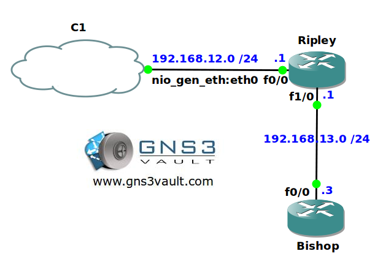

# RMON Alarms and Events

## Scenario

The Agency has created a new security policy and since you are part of the security team you need to help them implement them. Whenever anything funky happens on the network you want to ensure a RMON alarm informs the logging server what is going on.

## Goal

- All IP addresses have been preconfigured for you.
- Optional: You can use the cloud interface to connect your router to a free syslog server like Kiwi Syslog Server (also works for SNMPv2).
- Configure router Ripley to track the packet rate on the FastEthernet 1/0 interface.
- When the packet rate is above 50 packets you need to send a SMTP trap with the message "too much!".
- When the packet rate falls below 50 packets you need to send a SMTP trap with the message "ah much better!".
- Use SNMP community string "VAULT".
- Configure router Bishop to check the CPU average each 5 minutes. When it's above 85% it should generate a message "hot hot!". When it falls below 30% it should generate the message "Cool".
- Send these messages to SNMP server 192.168.12.2.

## IOS

c3640-jk9s-mz.124-16.bin

## Topology

