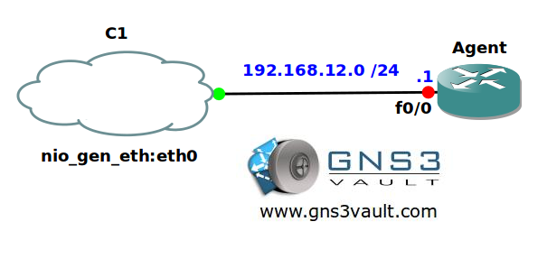

# SNMPv3 Server

## Scenario:

The Agency has created a new security policy and since you are part of the security team you need to help them implement them. Some changes on the network have to be implemented through SNMPv3 and it's up to you to configure your router as a SMPv3 agent.

## Goal:

* All IP addresses have been preconfigured for you.
* Optional: You can use the cloud interface to connect your router to a free syslog server like Spiceworks FREE SNMP Network Manager (also works for SNMPv3).
* Configure router Agent with a SNMP MIB VIEW called "EVERYONE".
* Configure router Agent with a SNMP MIB VIEW called "FORYOUREYESONLY"
* Configure router Agent so "EVERYONE" contains branch "iso".
* Configure router Agent with a SNMP group called "EVERYONE". Use security model "priv". Assign read/write view to SNMP MIB VIEW "EVERYONE".
* Configure router Agent with a user called "007". Use MD5 password "VAULT" and DES encryption password "SAFE". Add this user to the "EVERYONE" group.
* Configure router Agent with a SNMP group called "FORYOUREYESONLY". Use security model "auth". Assign read view to SNMP MIB VIEW "FORYOUREYESONLY".
* Configure router Agent with a user called "bigeyes". This user only requires the password "LENS". Add the user to the "FORYOUREYESONLY" group.
* Configure router Agent so only users from network 192.168.12.0 /24 are allowed to access the SNMP GROUP "EVERYONE".
* Configure router Agent with a group called "KICKME" and use security model "priv".
* Configure router Agent with a user called "WILL" and add him to the group "KICKME". Use password "VAULT".
* Configure router Agent with SNMP traps to host 192.168.12.2 and use security model 'priv'. Use username "WILL".
* Configure router Agent to send a SNMP trap for event 'warmstart' and 'coldstart'.

## IOS:

c3640-jk9s-mz.124-16.bin

## Topology:
