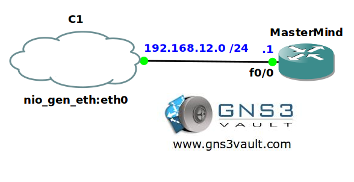

# Syslog Server Logging

## Scenario

Router MasterMind has a large memory but due to security reasons you want to make sure all logging information isn't saved locally but dumped to an external syslog server. You don't want to use the default configuration though so let's see how you can tune syslog logging...

## Goal

- All IP addresses have been preconfigured for you.
- Router MasterMind has a loopback0 interface with IP address 1.1.1.1 /24.
- Optional: You can use the cloud interface to connect your router to a free syslog server like Kiwi Syslog Server.
- Configure router MasterMind so it sends all logging information to a syslog server with IP address 192.168.12.2.
- Configure router MasterMind so a reliable protocol is used for logging messages and use port 4040.
- Configure router MasterMind so logging messages are sent from the loopback0 interface.
- Configure router MasterMind so all messages are logged up to the emergencies level.
- Configure router MasterMind so it uses origin-ID string "MasterMind" and facility local1.

## IOS

c3640-jk9s-mz.124-16.bin

## Topology

