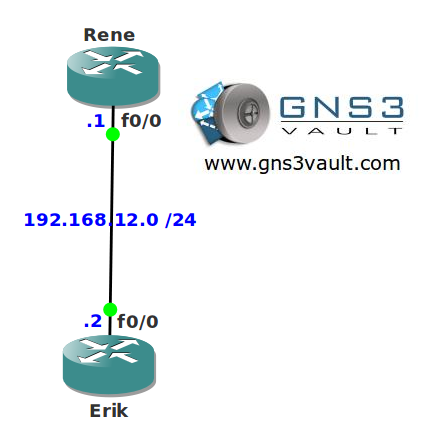

# System Message Logging

## Scenario

Two brothers are working as network consultants. One of their customers asked them to implement logging system messages on their routers. There is no central logging server so you need to configure the routers for optimal logging.

## Goal

- All IP addresses have been preconfigured for you.
- EIGRP has been configured for connectivity.
- Output from debug messages on router Erik should be sent to the console but limited to 3 messages per second.
- Both routers have to save debugging messages to their buffers up to 4096 bytes.
- Messages on the console log should not interrupt any command output.
- When you login router Rene using telnet you should only see messages from level "notifications" and higher.

## IOS

c3640-jk9s-mz.124-16.bin

## Topology

