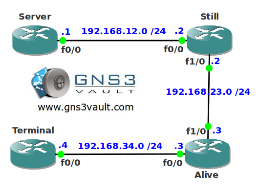

# TCP Keepalive

## Scenario

A well-known science laboratory specialized in researching "portal" technology has a small network running OSPF. One of their terminals is used by a scientist to reach a central server. However every time router Alive crashes it's impossible to re-connect to the central server. Besides a scientist you are also a network engineer, let's see if you can portal yourself out of this one...

## Goal

* All IP addresses have been preconfigured for you.
* OSPF has been configured for connectivity.
* Configure router Terminal so it detects dead TCP connections and closes them.
* You can test this by using telnet on router Server to router Terminal and shutting the F1/0 interface on router Alive afterwards to simulate a dead connection.

## IOS

c3640-jk9o3s-mz.124-16.bin

## Topology

## Video Solution

[Watch on YouTube](http://www.youtube.com/watch?v=2Oo3Asc-OYI)
