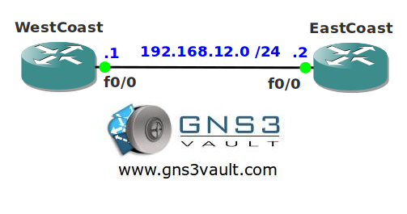

# Telnet Server Tuning

## Scenario

You own a company specialized in network and router tuning. One of your customers sells customized cars and uses telnet to work remotely between their two sites. They would like you to tweak their telnet server for optimal settings. Think you can pimp this ride?

## Goal

* All IP addresses have been preconfigured for you.
* EIGRP has been configured for connectivity.
* Configure router WestCoast so it sources all telnet sessions from the loopback0 interface.
* Configure router WestCoast so it uses DSCP value "EF" for all telnet sessions.
* Configure router WestCoast so it doesn't show any informational telnet messages.

## IOS

c3640-jk9o3s-mz.124-16.bin

## Topology

