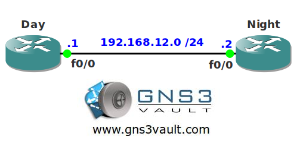

# Virtual Terminal Line Settings

## Scenario

Your network has two routers called Day and Night. Users behind router Day are using telnet to access router Night. Some users have been complaining that telnet access should be easier so you decide to look at it and do some tuning.

## Goal

- All IP addresses have been preconfigured for you.
- Configure router Night so only VTY line 0 - 2 will be used.
- Configure router Night so it uses port 3050 for telnet.
- Configure router Night so it shows a "Sorry Busy!" message when there are no available VTY lines.
- When someone from router Day telnets into router Night and makes a typing error it shouldn't try to do a domain lookup.
- Configure router Night so telnet sessions drop at 1 minute of inactivity.
- Configure router Night so telnet sessions will always drop after 2 minutes.
- Configure router Night so users can lock a VTY line.

## IOS

c3640-jk9o3s-mz.124-16.bin

## Topology

