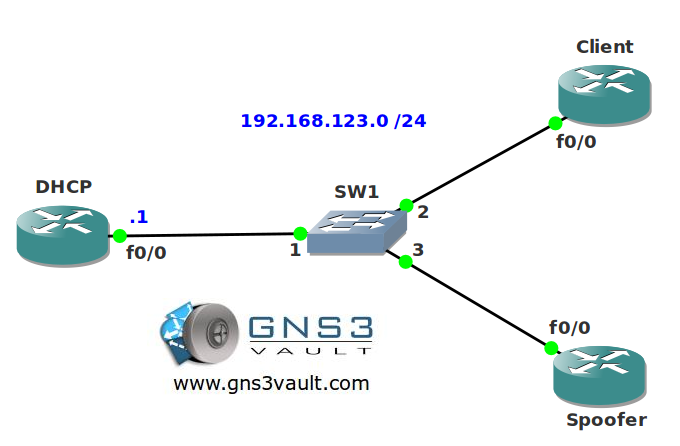

# DHCP Authorized ARP

## Scenario

You work as a network engineer for a Hotel offering Internet access for an hourly rate. Recently you notice that some customers have been spoofing MAC and IP addresses to get free access by pretending they are another customer. After kicking them out of the hotel you decide to make some changes to DHCP so this can't happen anymore.

## Goal

- The IP address for router DHCP has been preconfigured for you.
- Configure router DHCP as a DHCP server for network 192.168.123.0 /24.
- Configure router DHCP so whenever router CLIENT sends a DHCP Discover it will install a secure ARP entry.
- Configure router DHCP so it sends ARP messages every 60 seconds to ensure router CLIENT is still there.
- Configure router SPOOFER with an IP address and see how things have changed.

## IOS

c3640-jk9o3s-mz.124-16.bin

## Topology

## Video Solution

[Video: DHCP Authorized ARP Solution](http://www.youtube.com/watch?v=gct9bDSu9BY)
