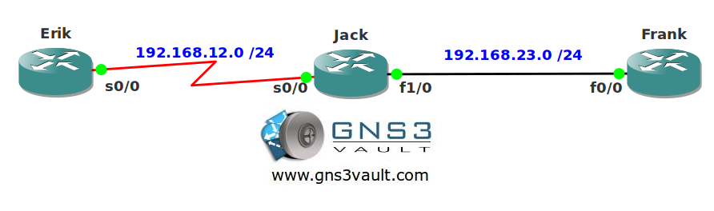

# DHCP Proxy

## Scenario

You used to have a DHCP server for each VLAN but this wasn't much of a scalable solution. You decide to get rid of all the DHCP servers and install a single DHCP server in the datacenter. You see that the clients are sending DHCP discover messages but they are not reaching the DHCP server, some of your routers are using serial links with PPP so you want to make sure they can get IP addresses as well.

## Goal

- All IPv4 addresses have been preconfigured for you.
- Configure router Erik and Jack for PPP encapsulation.
- Configure router Erik so it requests an IP address through IPCP.
- Configure router Frank as a DHCP server and ensure it can reach out an IP address to router Erik.

## IOS

c3640-jk9o3s-mz.124-16.bin

## Topology

## Video Solution

http://www.youtube.com/watch?v=UxwGiVALgfs
