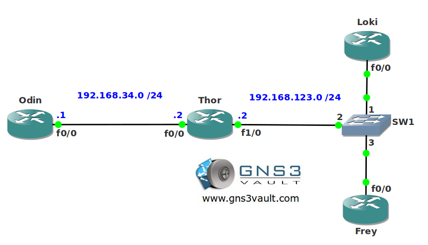

# DHCP Relay

## Scenario

You used to have a DHCP server for each VLAN but this wasn't much of a scalable solution. You decide to get rid of all the DHCP servers and install a single DHCP server in the datacenter. You see that the clients are sending DHCP discover messages but they are not reaching the DHCP server, up to you to relay some packets...

## Goal

- All IPv4 addresses have been preconfigured for you.
- Configure router Odin as a DHCP server.
- Ensure router Loki and Frey can get an IP address from the DHCP server.

## IOS

c3640-jk9o3s-mz.124-16.bin

## Topology

## Video Solution

http://www.youtube.com/watch?v=V-0ubwujny4
