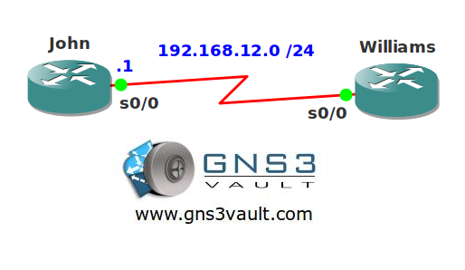

# DHCP Server On-Demand Addres Pool

## Scenario

Your network has many serial links running PPP. You heard some good things about DHCP and how you can create on-demand pools using IPCP. Let's see if it works the way you expect...

## Goal

- Configure both routers for PPP encapsulation.
- Configure router John so router Williams receives IP address 192.168.12.2 thanks to IPCP.
- Configure router William with a DHCP pool that imports the subnet mask that it receives from router John.

## IOS

c3640-jk9o3s-mz.124-16.bin

## Topology

## Video Solution

[Video: DHCP Server On-Demand Address Pool](http://www.youtube.com/watch?v=V7Qc25B-51I)
