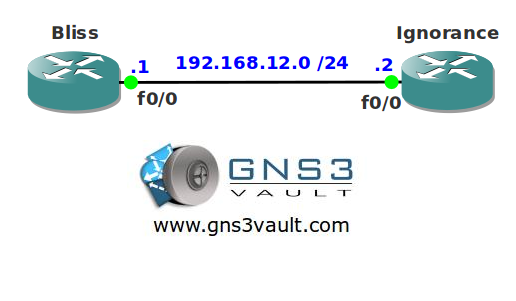

# DHCP Server

## Scenario

You are a trainee and studying for your CCNA certification. Your boss asks you if you can configure a DHCP server for some wireless clients. Confident as you are you take one of your routers and start typing in commands...

## Goal

* The IP address on router Bliss has been preconfigured for you.
* Configure a DHCP pool on router Bliss called "VAULT" with the following configuration:
  * Clients should use the DNS server with IP address 1.1.1.1.
  * Clients should use network 192.168.12.0 /24.
  * Clients should not use the 192.168.12.10 - 20 range.
  * Clients should renew their IP address after 2 hours.
* Configure router Bliss so it does not respond to BOOTP.
* Configure router Bliss so it stores DHCP bindings in flash.
* Configure router Ignorance so it receives an IP address through DHCP.

## IOS

c3640-jk9s-mz.124-16.bin

## Topology

## Video Solution

[Video Solution on YouTube](http://www.youtube.com/watch?v=8E8e1232ZiM)
