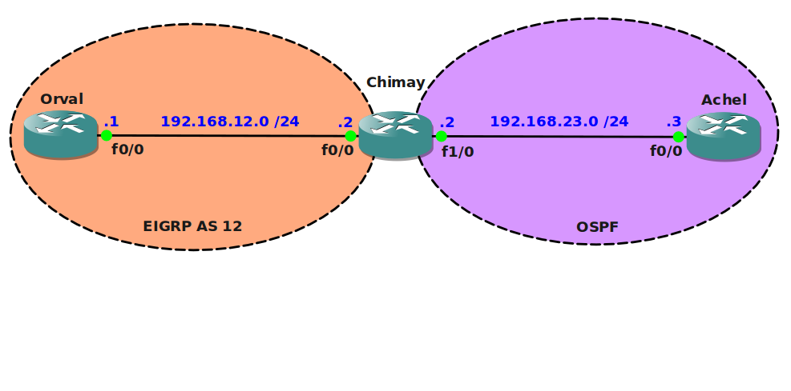

# Distribute List Filtering

## Scenario

Ever since you were a child you wanted to be a trappist monk, the silence of the monastery and the science of trappist beer have been a part of your life as far as you can remember. Recently the monastery decided to cooperate with other monks to share information about the brewing process of trappist beer. One of the monks configured the routers and has setup redistribution between EIGRP and OSPF so there is full connectivity between the networks. However, your monastery holds some precious recipies that are not to be shared with everyone, you need to make sure access to these networks is filtered in the routing or redistribution process....Cheers!

## Goal

* All IP addresses have been preconfigured for you.
* OSPF and EIGRP have been preconfigured for you on the corresponding routers.
* Redistribution has been preconfigured for you on router Chimay.
* Router Orval and Achel both have 2 loopback interfaces:
  * Orval: L0: 1.1.1.1 and L1: 11.11.11.11
  * Achel: L0: 3.3.3.3 and L1: 33.33.33.33
* You are not allowed to make any changes to the network commands under the OSPF or EIGRP process.
* Ensure router Chimay does not advertise the 3.3.3.0 /24 network towards router Orval, use an access-list to accomplish this.
* Ensure router Orval does not advertise the 1.1.1.0 /24 network towards router Chimay, use a prefix-list to accomplish this.
* Ensure router Chimay does not redistribute the 11.11.11.0 network into OSPF, use a route-map to accomplish this.

## IOS

c3640-jk9s-mz.124-16.bin

## Topology

## Video Solution

http://www.youtube.com/watch?v=ThdivcRrQQE
