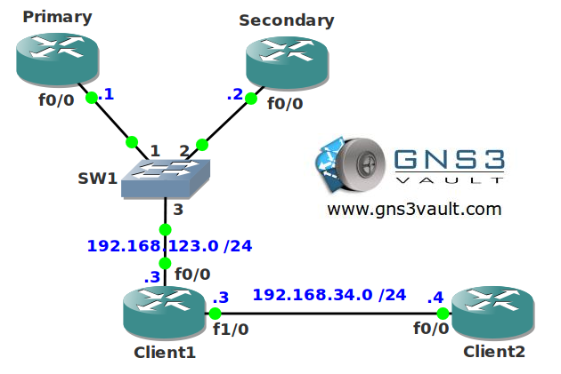

# DNS Server

## Scenario:

You are responsible for the network of a major international hotel organization. You make sure that all the guests can use the Internet services. One of the things you need to do is ensure DNS lookups can be done quickly without relying too much on external DNS servers. You decide to use one of your routers for the job...

## Goal:

- All IP addresses have been preconfigured for you.
- OSPF has been preconfigured for full connectivity.
- Configure router PRIMARY as the primary DNS server for domain "vault.local". This router should use hostname ns1.vault.local.
- Configure router SECONDARY as the secondary DNS server for domain "vault.local". This router should use hostname ns2.vault.local.
- Router CLIENT1 should be able to resolve the hostnames of the DNS servers.
- Router CLIENT1 should use both DNS servers by using round-robin.
- Router CLIENT2 should do DNS lookups by using CLIENT1.
- Configure a loopback0 interface on router CLIENT1 with IP address 3.3.3.3 /24.
- Configure the network so CLIENT1 responds with IP address 3.3.3.3 as a DNS response when the DNS servers are unreachable.

---

## IOS:

- c3640-jk9s-mz.124-16.bin

## Topology:

## Video Solution:

[Video on YouTube](http://www.youtube.com/watch?v=hMB5iRv_Kjk)
