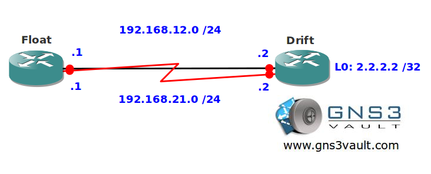

# Floating Static Routes

## Scenario

While you are drifting on a inflatable bed at your swimming pool you fall asleep and dream about floating static routes. There's this issue at work you couldn't solve but sometimes the best ideas arrive in your dreams right?

## Goal

- All IPv4 addresses have been preconfigured for you.
- Create two static routes on router Float pointing to the loopback0 interface of router Drift.
- Ensure the FastEthernet link is used for all traffic, when it fails traffic should be sent down the serial link.

## IOS

- c3640-jk9s-mz.124-16.bin

## Topology

## Video Solution

http://www.youtube.com/watch?v=LBdbE6wBvBk
