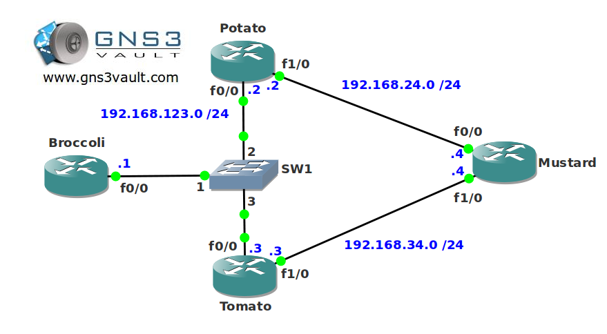

# ICMP Router Discovery Protocol (IRDP)

## Scenario

As the senior network engineer for "Groceries 'r' Us" you are responsible for all routing within the company. The network you are running is fairly old and doesn't support any fancy routing protocols. Your routers seem to support ICMP Route Discovery Protocol (IRDP) but you are not sure what it does...time to find out!

## Goal

- All IP addresses have been preconfigured for you.
- You are not allowed to use any routing protocol or static routing.
- Disable IP routing on router Broccoli.
- Configure router Potato and Tomato to advertise themselves as gateways for router Brocolli.
- Router Tomato should be the default gateway.

## IOS

- c3640-jk9o3s-mz.124-16.bin

## Topology

## Video Solution

- [YouTube Video Solution](http://www.youtube.com/watch?v=WvPGdf0bueA)
