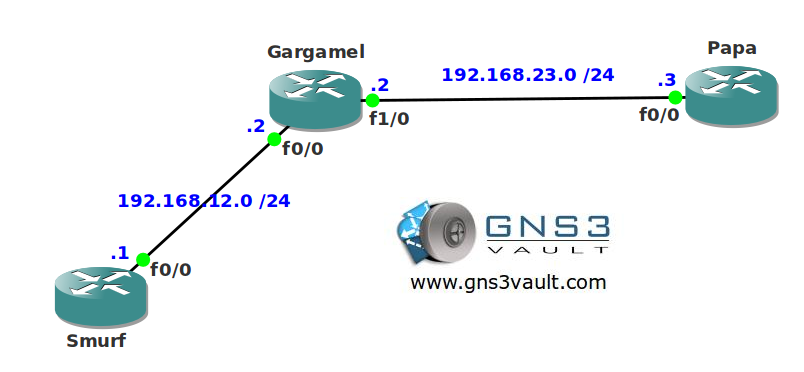

# IP Directed Broadcast

## Scenario

The smurfs got tired of recording cartoons so they decided to become network engineers. Unfortunately they are still using a very old application that only works using broadcast traffic. You need to change the network so it's possible for them to use the application.

## Goal

- All IP addresses have been preconfigured for you.
- Configure the network so router Smurf can send packets to IP address 192.168.23.255

## IOS

c3640-jk9s-mz.124-16.bin

## Topology

## Video Solution

http://www.youtube.com/watch?v=cYlz0h5NHbA
