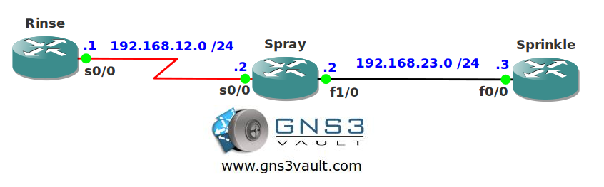

# IP Event Dampening

## Scenario

Garden Tools inc. has some trouble with their network. Every now and then the serial link fails which results in flapping networks for their routing protocol EIGRP. You want to configure damping so this is no issue anymore.

## Goal

- All IP addresses have been preconfigured for you.
- Configure EIGRP AS 1 and achieve full connectivity.
- Configure dampening on router Spray so whenever the serial link fails the route will not be advertised in EIGRP for 20 seconds. It shouldn't be dampened for more than 40 seconds.

## IOS

c3640-jk9s-mz.124-16.bin

## Topology

## Video Solution

[Video Solution on YouTube](http://www.youtube.com/watch?v=63BLfPjJWj0)
