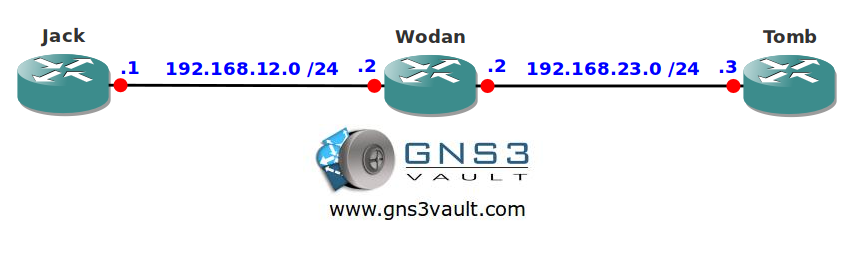

# IP Precedence and MAC Address Accounting

## Scenario

Your boss is very interested to know which MAC addresses on the network are responsible for most traffic. Besides MAC addresses you would also like to see how many packets are marked with IP precedence. Time for some accounting...

## Goal

- All IP addresses have been preconfigured for you.
- Configure EIGRP AS 1 on all routers and achieve full connectivity.
- Configure MAC address accounting on the FastEthernet 0/0 interface of router Wodan.
- Configure IP Precedence accounting on the FastEthernet 1/0 interface of router Wodan.

## IOS

c3640-jk9s-mz.124-16.bin

## Topology

## Video Solution

http://www.youtube.com/watch?v=gDc4eWxq4JQ
