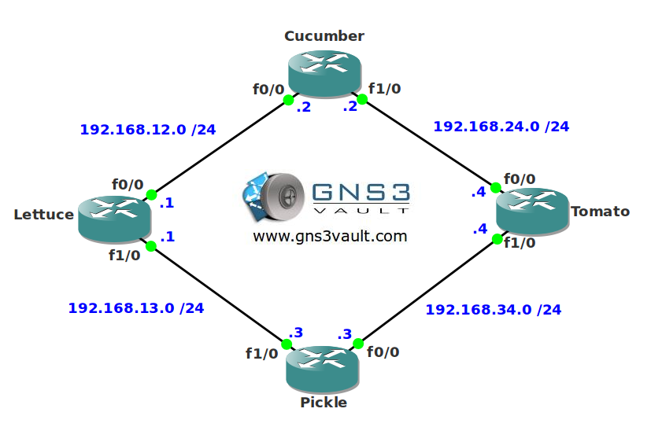

# IP Service Level Agreement (SLA)

## Scenario

As the senior network engineer for "Groceries 'r' Us" you are responsible for all routing within the company. Every now and then you have links that are still in the up/up state but you are unable to send any IP packets over them. You also would like something that could generate different traffic streams like RTP to simulate VoIP or HTTP. You heard good things about IP SLA so you decide to build a lab and test some things...

## Goal

- All IP addresses have been preconfigured for you.
- OSPF has been configured for full connectivity.
- Configure router Lettuce to send ICMP echo packets to IP address 4.4.4.4 every 9 seconds. It should never stop.
- Configure router Cucumber to send DNS request packets to IP address 1.1.1.1 every 8 seconds. It should never stop.
- Configure router Pickle to send G711 packets to IP address 2.2.2.2 port 16384 with a codec-size of 160 bytes with an interval of 20ms. It should never stop.
- Configure router Cucumber to respond to the G711 packets.
- Configure router Tomato to send G729 packets to IP address 3.3.3.3 port 16374 with a codec-size of 20 bytes. It should never stop.
- Configure router Pickle to respond to the G729 packets.
- Configure router Lettuce to send HTTP GET packets to IP address 192.168.34.4 every 60 seconds.

## IOS

c3640-jk9o3s-mz.124-16.bin

## Topology

## Video Solution

http://www.youtube.com/watch?v=TZFUCwoQjx4
