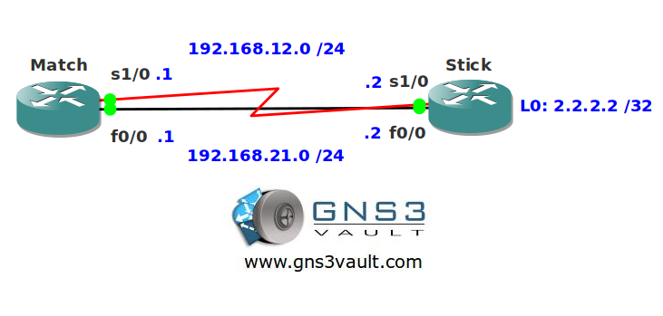

# Longest Prefix Match Routing

## Scenario

The local matchstick factory needs your help. They added another link between their routers but now everything is being load balanced between the serial and FastEthernet interface. They want to make sure everything is sent down the FastEthernet link and use the serial link as a backup.

## Goal

- All IPv4 addresses have been preconfigured for you.
- You are not allowed to change the administrative distance or configure any routing protocols.
- Ensure the FastEthernet link is used as primary link to reach the loopback0 interface of router Stick.
- Whenever the FastEthernet link fails you should use the serial link.

## IOS

c3640-jk9s-mz.124-16.bin

## Topology

## Video Solution

http://www.youtube.com/watch?v=9MUkSKt8unw
