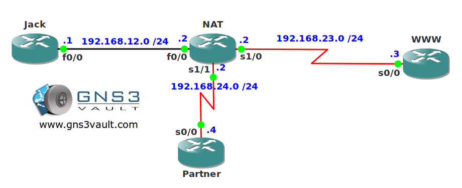

# NAT and Route-Map

## Scenario

Your network has two connections to the outside world. One is used for the Internet and the other one connects to a partner. You are using NAT to translate the IP addresses of your LAN but you want to ensure the correct IP addresses will be used...time to combine route-maps with NAT!

## Goal

- All IP addresses have been preconfigured for you.
- Configure router NAT so when router Jack communicates with router WWW it will be translated to an IP address in the 192.168.23.0 /24 range.
- Configure router NAT so when router Jack communicates with router Partner it will be translated to an IP address in the 192.168.24.0 /24 range.

## IOS

c3640-jk9o3s-mz.124-16.bin

## Topology

## Video Solution

[YouTube Video](http://www.youtube.com/watch?v=SUbJulQ7y_I)
