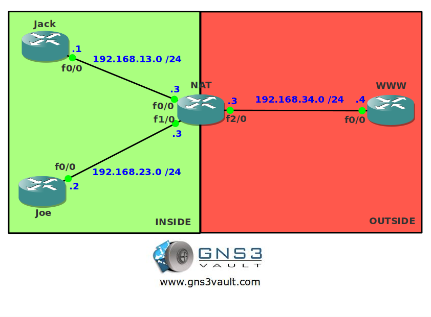

# NAT Dynamic

## Scenario

Your friends Jack and Joe recently switched to a new Internet provider and instead of getting a single public IP address they have received multiple global IP addresses. To make sure all global IP addresses are used they ask you to configure NAT Dynamic for them. Action time!

## Goal

* All IPv4 addresses have been preconfigured for you.
* IP Routing has been disabled and a default gateway is configured on router Jack, Joe and WWW.
* Configure a pool for NAT Dynamic called "GNS3VAULT". The range of IP addresses you received from the Internet Provider is 172.16.0.1 - 172.16.0.100.
* Configure NAT Dynamic so when router Jack or Joe connect to router WWW they are translated to one of the IP addresses in the pool.

## IOS

**Image**: c3640-jk9s-mz.124-16.bin

## Topology

## Video Solution

[NAT Dynamic - Video Solution](http://www.youtube.com/watch?v=jPcbcZQAJ6o)
