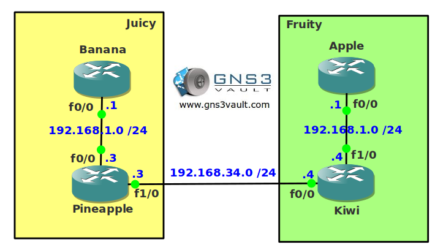

# NAT Overlapping Networks

## Scenario

Fruity international has bought Juicy Corporate and is merging the companies into a new one called "Fruity Juicy". You are the network engineer responsible for the network migration. Unfortunately both networks are using the same address space so you'll have to use NAT temporarily so you can do an IP address migration somewhere in the future.

## Goal

- All IP addresses have been preconfigured for you.
- Ensure router Banana and Apple can communicate with each other without changing any IP address.

## IOS

c3640-jk9o3s-mz.124-16.bin

## Topology

## Video Solution

[Video Tutorial](http://www.youtube.com/watch?v=Srca-sbtBv0)
