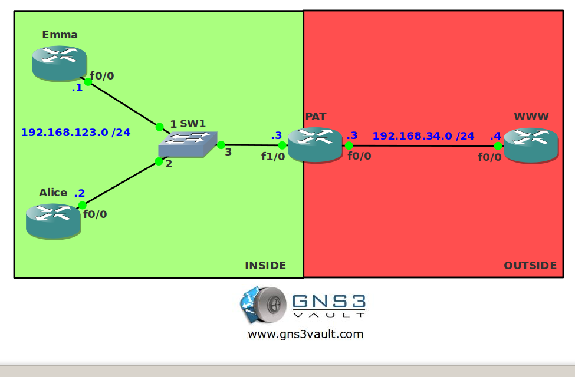

# NAT PAT Overload

## Scenario

Emma and Alice are in trouble. They just got a new Internet connection but they forgot to mention to the Internet provider that they required two public IP addresses so they both can access the Internet at the same time. Can you help the damsels in distress?

## Goal

- All IPv4 addresses have been preconfigured for you.
- IP Routing has been disabled and a default gateway is configured on router Emma, Alice and WWW.
- Configure PAT so when router Emma or Alice sends an IP packet to router WWW the source address is translated to the IP address on the F0/0 interface of router PAT.

## IOS

c3640-jk9s-mz.124-16.bin

## Topology

## Video Solution

http://www.youtube.com/watch?v=jCr24iGIqko
