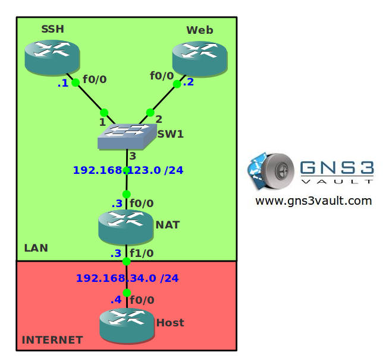

# NAT Port Forwarding

## Scenario

Your network at home has been configured for NAT so you and the rest of your family can access the Internet. You also have a webserver and a SSH server at home and you would like those to be accessible to the rest of the world. Time for some good old port forwarding on your Cisco router.

## Goal

- All IPv4 addresses have been preconfigured for you.
- Static routes have been configured on the webservers and the host for full connectivity.
- When router Host sends an IP packet to IP address 192.168.34.3 port 80 it should be sent to the webserver.
- When router Host sends an IP packet to IP address 192.168.34.3 port 22 it should be sent to the SSH server.

## About This Lab

## IOS

- **Image**: c3640-jk9s-mz.124-16.bin

## Topology

## Video Solution

[Watch on YouTube](http://www.youtube.com/watch?v=WW8156W4Xao)
