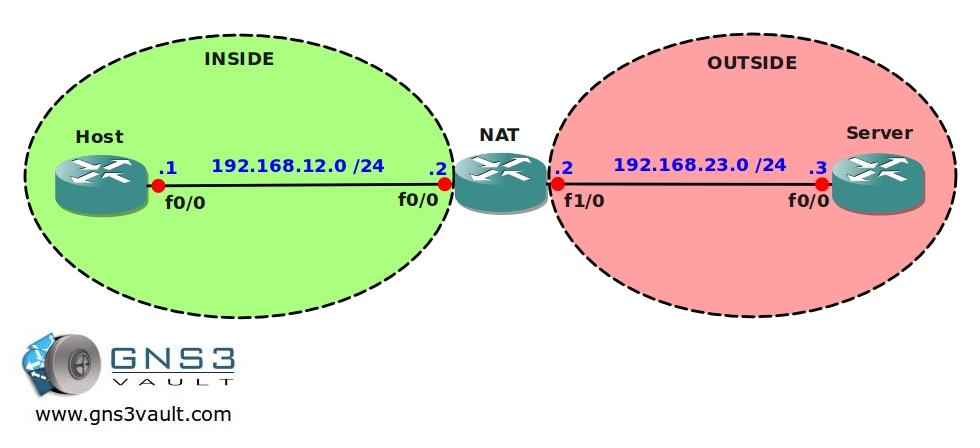

# NAT Static

## Scenario

As one of the network engineers for a small company you are responsible for all network operations. One of the branch offices has a single host PC that needs access to a server located on the internet. You only have private IP addresses for your internal network so you need to configure network address translation (NAT). Since there is only a single host a static NAT will be sufficient.

## Goal

- IP addresses have been preconfigured as specified in the topology picture.
- Create a static NAT configuration on router NAT to translate the 192.168.12.1 IP address into the 192.168.23.2 IP address.
- You are not allowed to translate any port numbers.

## IOS

c3640-jk9s-mz.124-16.bin

## Topology

## Video Solution

[Video: NAT Static Configuration](http://www.youtube.com/watch?v=daCFd29KwxQ)
