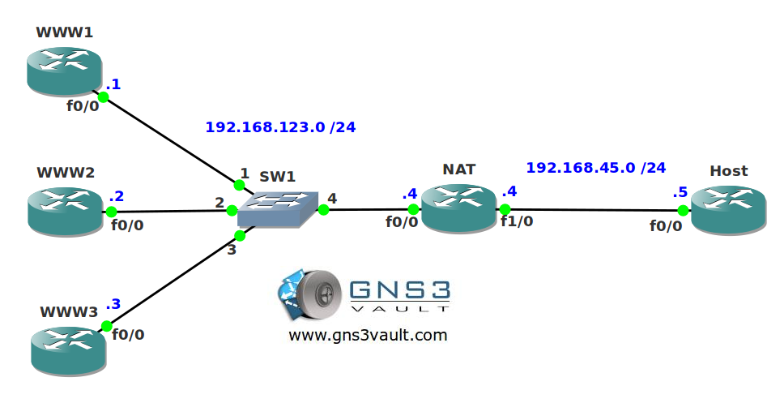

# NAT TCP Load Balancing

## Scenario

You are working as a networking trainee and in your pasttime you enjoy troubleshooting networks. Your roommate has a huge website and has bought multiple webservers to host the website. He doesn't have any more money for a decent load balancer so he asks you if you know any other method to share traffic along the webservers. Let's see if you can keep your balance...

## Goal

- All IPv4 addresses have been preconfigured for you.
- Static routes have been configured on the webservers and the host for full connectivity.
- Configure HTTP server on all webservers.
- Whenever router host sends an IP packet to IP address 192.168.45.100 port 80 it should be load-balanced using round-robin among the webservers.

## IOS

c3640-jk9s-mz.124-16.bin

## Topology

## Video Solution

http://www.youtube.com/watch?v=hSbY2E4mVNU
