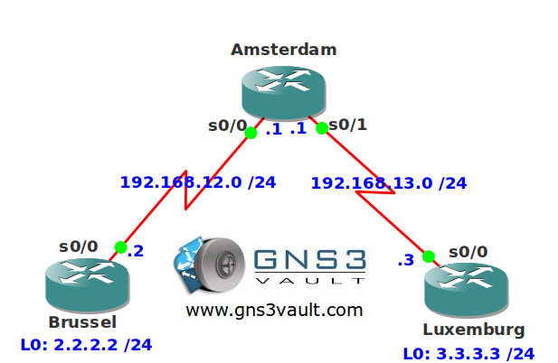

# ODR (On Demand Routing)

## Scenario

The international network of the Benelux doesn't have any more fancy equipment since the last cost saving project. The current routers don't support any routing protocol except ODR (On Demand Routing). You don't want to use static routes so it's up to you to setup ODR.

## Goal

- All IPv4 addresses have been preconfigured for you.
- Configure ODR on all routers and ensure you can reach the loopback interfaces of router Brussel and Luxemburg.

## IOS

c3640-jk9s-mz.124-16.bin

## Topology

## Video Solution

http://www.youtube.com/watch?v=BKVWKOfB4VM
