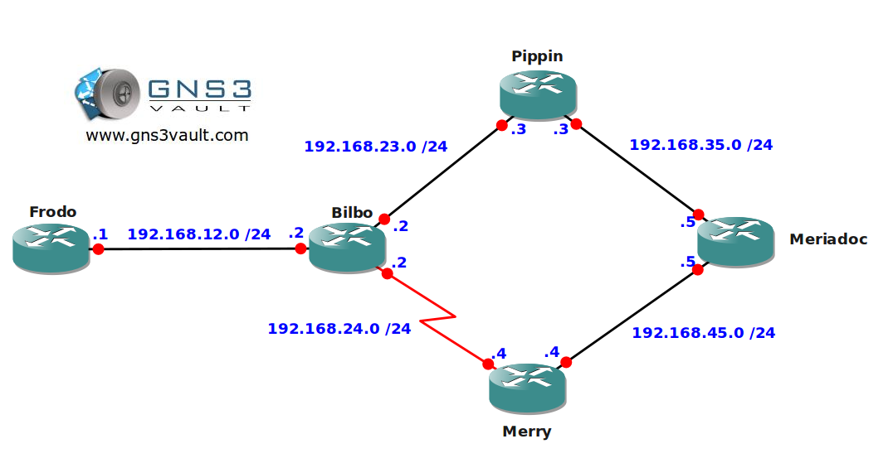

# Policy Based Routing

## Scenario

After getting rid of the ring that ruled them all things have changed in Middle Earth. The hobbits have become network engineers and are interconnecting every creature in their fantasy world. OSPF is the routing protocol of choice but the hobbits have some problems since all traffic is sent down the same path. Do you think you can help them out by teaching them Policy Based Routing?

## Goal

- All IP addresses have been preconfigured for you.
- OSPF has been preconfigured for you for full connectivity.
- Do not make any changes to OSPF.
- Make changes on router Bilbo so traffic from 1.1.1.0 towards router Meriadoc is sent down the serial link.
- Make changes on router Bilbo so traffic from 192.168.12.1 towards 33.33.33.33 is sent down the serial link.
- Make changes on router Bilbo so packets that are greater than 200 bytes are sent down the serial link.
- Make changes on router Bilbo so traffic from 192.168.12.2 towards 3.3.3.3 is sent down the serial link.

## IOS

c3640-jk9s-mz.124-16.bin

## Topology

## Video Solution

[http://www.youtube.com/watch?v=T-cv2H6SP5c](http://www.youtube.com/watch?v=T-cv2H6SP5c)
