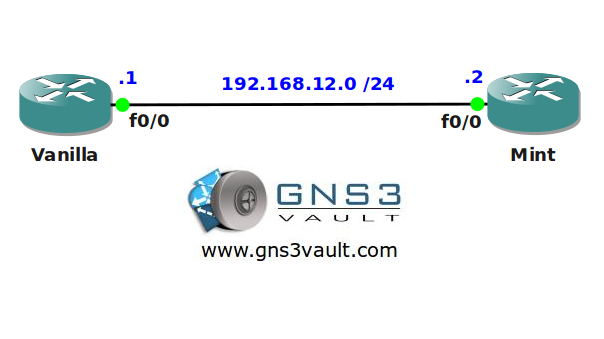

# Prefix List Filtering

## Scenario

As a true coffee addict and network junkie you are working on the network of a world famous coffeeshop. Today your caffeine rush kicks in and you have a sudden desire to clean up some of the routing tables on the company routers. Let's see what you can do here with a couple of prefix-lists. Black......no sugar, no milk!

## Goal

- All IP addresses have been preconfigured for you.
- EIGRP AS12 has been preconfigured for you.
- Router Mint advertises a bunch of prefixes to router Vanilla, take a quick look at the routing table to see them.
- You are only allowed to use one prefix-list.
- Create a single prefix-list statement to filter out all /32 networks in the 1.0.0.0 range, as a result the 1.0.0.0 /30's should still be in Vanilla's routing table.
- Create a single prefix-list statement to filter out any subnet in the Class B network range.
- Create a single prefix-list statement to filter out any subnet in the Class C network range that has a subnetmask of /25, /26 or /27. As a result all the Class C subnets with /24 or higher than /27 should still be in Vanilla's routing table.
- Create a single prefix-list statement to filter out all subnets in the 2.0.0.0 range which has less than 256 IP addresses.
- Change your prefix-list so that only the default-route is allowed, as a result only the default route should be in Vanilla's routing table.

## IOS

c3640-jk9s-mz.124-16.bin

## Topology

## Video Solution

http://www.youtube.com/watch?v=ZbRxRcn2Awk
