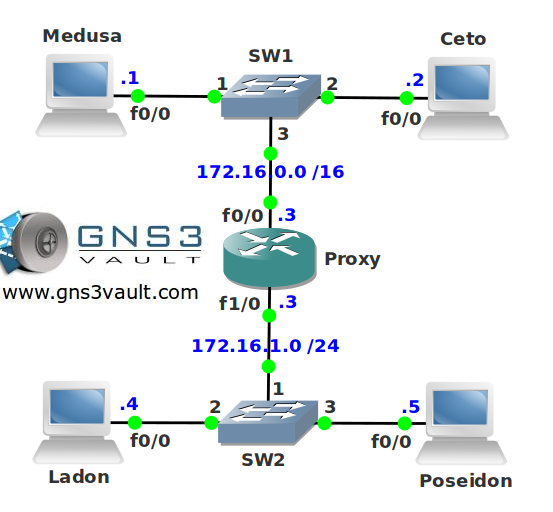

# Proxy ARP

## Scenario

One of the trainees has configured your network and has assigned static IP addresses to all computer in the network. Unfortunately he made some errors and the computers are not able to reach each other. Think you can help him out?

## Goal

* All IPv4 addresses have been preconfigured for you.
* Ensure all hosts can communicate with each other without changing the IP addresses.
* What MAC address does router Medusa use to reach router Ladon or Poseidon?

## IOS

c3640-jk9s-mz.124-16.bin

## Topology

## Video Solution

[http://www.youtube.com/watch?v=uU1iqR_r4qc](http://www.youtube.com/watch?v=uU1iqR_r4qc)
