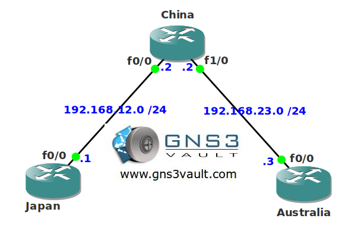

# Recursive Routing Failure

## Scenario

You work as the network engineer for a company with an ambitious plan to build a tunnel between Japan and Australia. To support this project you have to configure the network with some new routers. You configure your network but you receive some "%TUN-5-RECURDOWN: Tunnel0 temporarily disabled due to recursive routing" errors. Time to dig to the core of this problem...

## Goal

- All IPv4 addresses have been preconfigured for you.
- Configure RIP version 2 on all routers. Use "network 0.0.0.0" to advertise everything on all routers.
- Configure a tunnel0 interface between the FastEthernet interfaces of router Japan and Australia.
- Configure network 192.168.13.0 /24 on the tunnel0 interface.
- Solve your recursive routing failure in any possible way.

## IOS

c3640-jk9s-mz.124-16.bin

## Topology

## Video Solution

[YouTube: Recursive Routing Failure Solution](http://www.youtube.com/watch?v=U2W777W7VGk)
