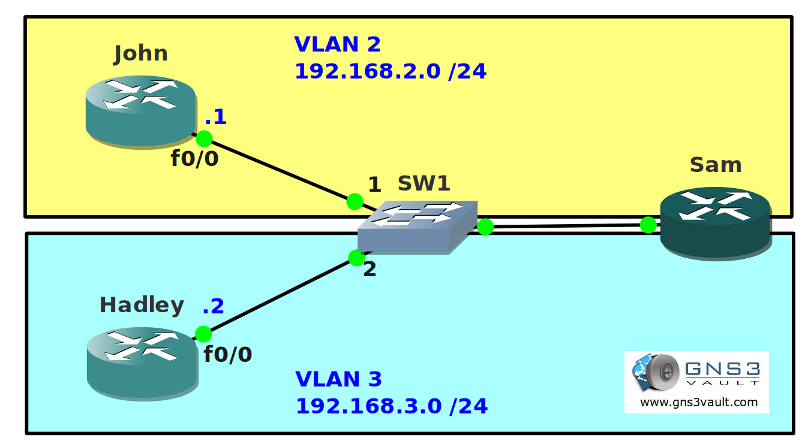

# Router on a stick

## Scenario

You are Sam the network engineer who is responsible for all routing within your company. Two of your colleagues called John and Hadley are having trouble reaching each other, their routers do not have any routing capabilities and they are located in different vlans. It's up to you to help them restore connectivity by becoming a router on a stick.

## Goal

- All IP addresses have been preconfigured as specified in the topology picture.
- Do not configure any routing protocol or use static routes.
- You are allowed to create additional interfaces and IP addresses on router Sam.
- Ensure router John and Hadley can ping each other.

## Overview

## IOS

- c3725-adventerprisek9-mz.124-15.T7.bin

## Topology

## Video Solution

- [YouTube Video Solution](http://www.youtube.com/watch?v=BF5y7i5yZEA)
