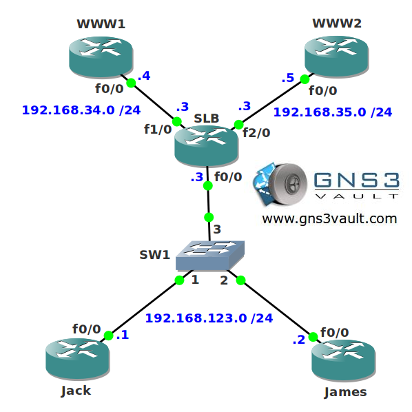

# Server Load Balancing (SLB)

## Scenario:

You are the senior network engineer for a large online webshop called "Booky Wooky". One of your load balancers recently failed and you don't have any replacement...business hasn't been so good since the ereaders have been launched a few years ago. You decide to take a spare router and configure it for load balancing...

## Goal:

* All IP addresses have been preconfigured for you.
* Configure router SLB so it spreads connections to the webserver in a round-robin fashion to router WWW1 and WWW2.
* Configure router SLB so WWW1 gets twice as many connections as WWW2.

## IOS:

c3640-jk9s-mz.124-16.bin

## Topology:

## Video Solution:

http://www.youtube.com/watch?v=J9sEB2kOqLw
